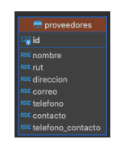
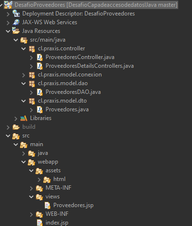
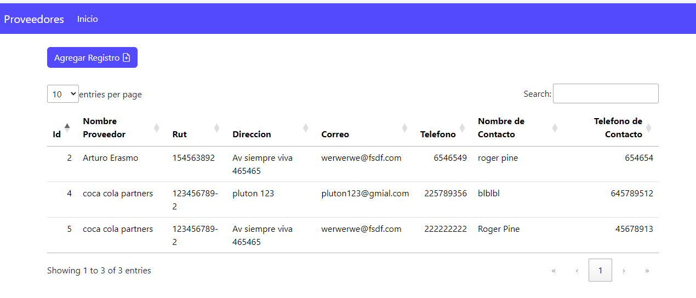
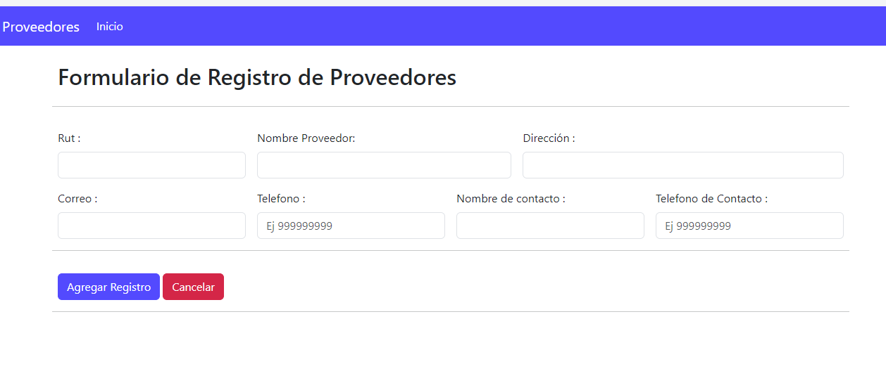
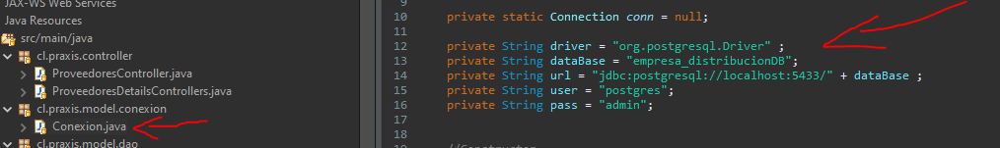

Desafío- Capa de acceso de datos (I)
--

En este desafío validaremos nuestros conocimientos para la obtención de datos desde una
tabla en el motor de base datos postgresql.

Para lograrlo, necesitarás aplicar todo lo aprendido desde la Unidad 2 – Servlets y lo
aprendido en esta unidad: Capa acceso de datos

Lee todo el documento antes de comenzar el desarrollo individual, para asegurarte de tener
el máximo de puntaje y enfocar bien los esfuerzos.

Tiempo asociado: 2 horas cronológicas.

Descripción
-

Una empresa dedicada a la distribución de mercaderías para negocios de barrio está
buscando implementar un sistema web que le ayude a administrar el negocio y su control de
proveedores. Para eso, han solicitado que en una primera etapa, el sistema registre y muestre
a los proveedores que abastecen a la empresa. El equipo encargado de la estructura de la
base de datos ha construido el siguiente modelo, que cumple con los requerimientos de esta
primera etapa: 

El script de creación del modelo es:

        CREATE TABLE public.proveedores (
        id SERIAL PRIMARY KEY,
        nombre varchar NOT NULL,
        rut varchar NOT null,
        direccion varchar NOT null,
        correo varchar NOT null,
        telefono varchar NOT null,
        contacto varchar NOT null,
        telefono_contacto varchar NOT null
        );

Al mostrar los datos de los proveedores se deben visualizar en una tabla ordenados
ascendentemente por el nombre del proveedor, mostrando todas las columnas.

<b><i>Aplicando los conceptos y herramientas aprendidas hasta ahora, generamos lo siguiente:</i></b>

1. Un proyecto Java Web Dinámico desde el IDE Eclipse.
2. Un archivo JSP de presentación para captura de valor de los datos de un proveedor.
3. Captura y validación de los parámetros enviados en el request y posterior proceso de
envío a la capa Manager.
4. Validar que la información ingresada en el formulario no sean null o vacío.
5. Implementación de una clase conexión tipo Singleton.
6. Conexión a base datos postgres por medio de driver.
7. Ejecutar query para la inserción y obtención de proveedores en clase de acceso a
datos.
8. Obtención de respuesta enviada desde la base de datos.
9. Redireccionar a vista JSP el resultado de la inserción o mensaje de error en caso de
no ejecutarse registro en la tabla.

Requerimientos
-
Mediante la utilización del IDE de desarrollo Eclipse, se debe crear un nuevo proyecto Web
Dinámico llamado <b><i>“DesafioProveedores”</i></b>, este proyecto debe ser desplegado bajo el servidor <b><i>Web Apache Tomcat 9 o 10.</i></b>

Una vez creado el proyecto, se debe crear la página <b><i>“index</i></b>.jsp”, la cual es el <b><i>JSP</i></b> de entrada,
en donde se debe visualizar el formulario con los campos a ingresar de los proveedores y
sección con tabla para mostrar todos los proveedores.
Se debe crear un <b><i>Servlet</i></b> en el cual se realiza la validación y se envía el resultado de la
operación matemática.
1. Crear un nuevo proyecto Java Web Dinámico de Nombre <b><i>“DesafioProveedores”.</i></b>
(2 Punto)
2. Crear la estructura <b><i>JSP</i></b> correspondiente a la vista requerida, considerando el envío de
los datos hacia el <b><i>Servlet</i></b> haciendo uso del método <b><i>POST.</i></b>
(2 Puntos)
3. Crear y vincular el servlet necesario para mostrar en una tabla el resultado esperado
por la operación de obtención de todos los proveedores insertados.
(2 Puntos)
4. Validar y enviar los parámetros rescatados e implementar métodos en la clase de
acceso de datos.
(2 Puntos)
5. Realizar las operaciones de persistencia, consulta de datos y retornarlas a la vista JSP.
(2 Puntos)

¡Mucho éxito!
- 

Consideraciones y recomendaciones

1. Se puede apoyar de los ejercicios anteriores a modo de consulta.
2. Recuerde tener previamente configurado su servidor tomcat dentro del IDE Eclipse.
3. Debes tener el motor de base datos PostgreSQL configurado.
4. Debes recordar cómo se crea y llena una tabla en postgres.
 
 ¡Vamos con todo!

 imagenes del proyecto realizado 
 -

 

 

 

Para realizar pruebas se debe cambiar los parametros de conexion Singleton a la Base de datos en el package conexion 

se adjunta imagen 

